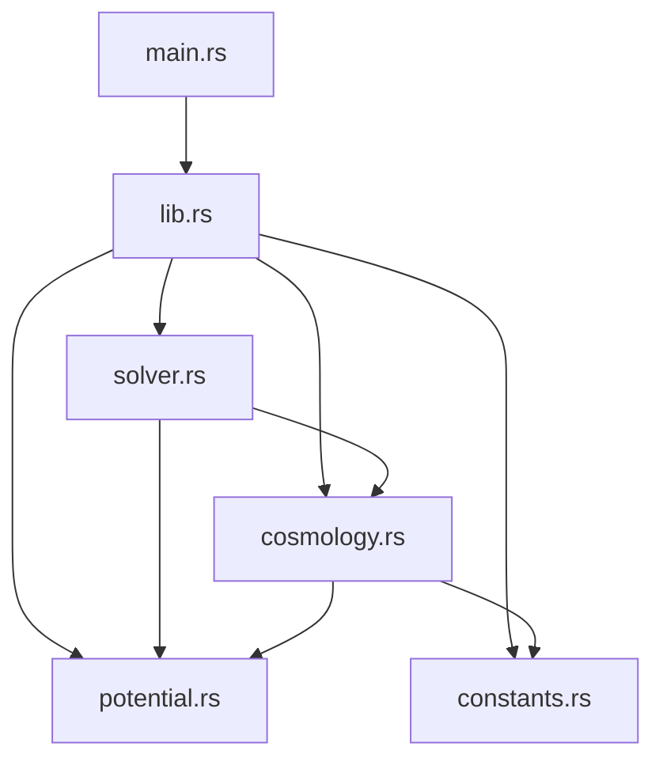

# SINGLE-FIELD-INFLATIONARY-PARAMTERS

## 目次
- [SINGLE-FIELD-INFLATIONARY-PARAMTERS](#single-field-inflationary-paramters)
  - [目次](#目次)
  - [このプロジェクトについて](#このプロジェクトについて)
  - [環境](#環境)
  - [ディレクトリ構成](#ディレクトリ構成)
  - [始め方](#始め方)
    - [Rustのインストールの仕方](#rustのインストールの仕方)
  - [モジュールの依存関係](#モジュールの依存関係)
  - [コマンド一覧](#コマンド一覧)
  - [トラブルシューティング](#トラブルシューティング)

## このプロジェクトについて
このリポジトリではスローロールインフレーションの観測量である、スペクトル指数 (spectral index) $n_s$ とテンソル・スカラー比 (tensor-to-scalar ratio) $r$ をインフレーションのモデルを仮定して計算します。


## 環境
| 言語・フレームワーク      | バージョン |
| --------------------- | ---------- |
| Rust                  | 1.89.0     |
| Python                | x.x.x     |


## ディレクトリ構成
> tree -I target
```
.
├── Cargo.lock
├── Cargo.toml
├── doc
│   ├── MEMO.md
│   ├── SPEC.md
│   └── TEST.md
├── GEMINI.md
├── README.md
└── src
    ├── constants.rs
    ├── cosmology.rs
    ├── lib.rs
    ├── main.rs
    ├── potential.rs
    └── solver.rs
```

## 始め方
Rustのインストールが必要です。  
```bash
rustc --version
>>> rustc 1.89.0 (29483883e 2025-08-04)
```
より低いバージョンで動作確認は実施していません。ご了承ください。

### Rustのインストールの仕方

下記の`curl`コマンドでRustのインストールができます。
```bash
curl --proto '=https' --tlsv1.2 -sSf https://sh.rustup.rs | sh
```
詳しくは[公式ページ](https://www.rust-lang.org/ja/tools/install)を参照してください。


## モジュールの依存関係
矢印は参照するモジュールを表している。



## コマンド一覧

## トラブルシューティング