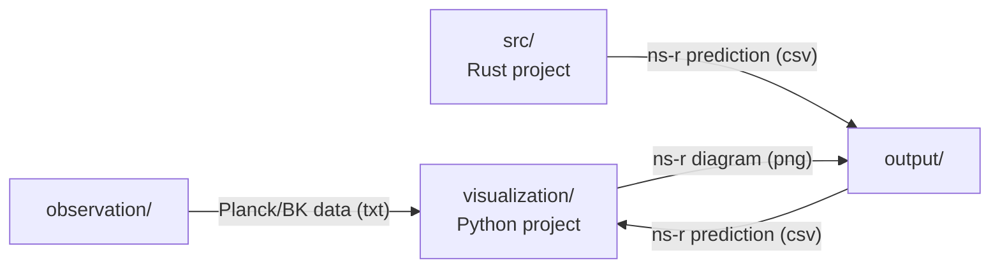
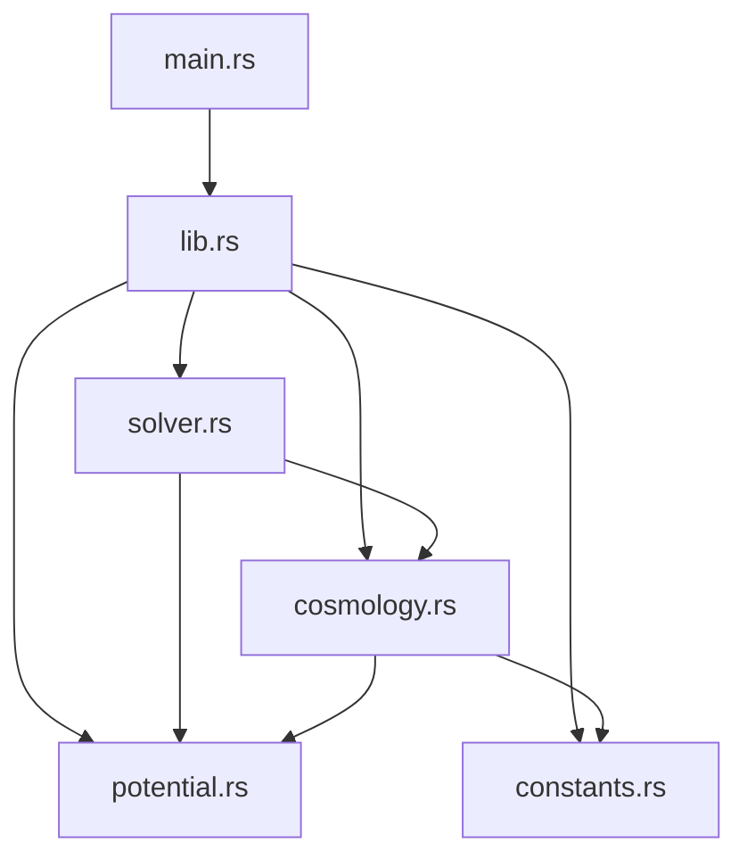

# SINGLE-FIELD-INFLATIONARY-PARAMTERS

## 目次
- [SINGLE-FIELD-INFLATIONARY-PARAMTERS](#single-field-inflationary-paramters)
  - [目次](#目次)
  - [このプロジェクトについて](#このプロジェクトについて)
  - [環境](#環境)
  - [ディレクトリ構成](#ディレクトリ構成)
  - [始め方](#始め方)
    - [Rustのインストールの仕方](#rustのインストールの仕方)
  - [モジュールの依存関係](#モジュールの依存関係)
  - [コマンド一覧](#コマンド一覧)
  - [トラブルシューティング](#トラブルシューティング)
- [付録](#付録)
  - [スローロール・インフレーション](#スローロールインフレーション)
    - [主要な式](#主要な式)
    - [宇宙論的な観測量](#宇宙論的な観測量)
    - [インフレーションモデルによる観測量の予言](#インフレーションモデルによる観測量の予言)

## このプロジェクトについて
このリポジトリではスローロールインフレーションの観測量である、スペクトル指数 (spectral index) $n_s$ とテンソル・スカラー比 (tensor-to-scalar ratio) $r$ をインフレーションのモデルを仮定して計算します。


## 環境
| 言語・フレームワーク      | バージョン |
| --------------------- | ---------- |
| Rust                  | 1.89.0     |
| Python                | x.x.x     |


   


## ディレクトリ構成
>  tree -I "target|venv|doc"
```
.
├── Cargo.lock
├── Cargo.toml
├── config.toml
├── GEMINI.md
├── observation                         # 観測データ
│   ├── Planck_BK18_ns_r_1sigma.txt 
│   └── Planck_BK18_ns_r_2sigma.txt
├── output                              # 生成されるデータの出力先
├── README.md
├── requirements.txt
├── src
│   ├── calculation.rs                  # ns-r計算
│   ├── config.rs                       # config.tomlから構造体作成する
│   ├── constants.rs                    # 物理・数学定数
│   ├── cosmology.rs                    # 宇宙論的パラメタ(ε, η, H)
│   ├── lib.rs                             
│   ├── main.rs
│   ├── models.rs
│   ├── potential.rs                    # インフレーションのポテンシャル
│   └── solver.rs
└── visualization
    └── visualize.py
```

## 始め方
Rustのインストールが必要です。  
```bash
rustc --version
>>> rustc 1.89.0 (29483883e 2025-08-04)
```
より低いバージョンで動作確認は実施していません。ご了承ください。

### Rustのインストールの仕方

下記の`curl`コマンドでRustのインストールができます。
```bash
curl --proto '=https' --tlsv1.2 -sSf https://sh.rustup.rs | sh
```
詳しくは[公式ページ](https://www.rust-lang.org/ja/tools/install)を参照してください。

### Pythonの仮想環境の立ち上げ

仮想環境を作成します。
```python
python3 -m venv venv
```

仮想環境を起動します。
```bash
source venv/bin/activate
```

必要なライブラリをインストールします。
```python
pip install -r requirements.txt
```

これで必要なセットアップは完了です。

## プロジェクト構造の概要
### DFD
ルートパスから見た時のプロジェクトのディクトリ同士のDFDは下記の通りです。




## モジュールの依存関係
矢印は参照するモジュールを表しています。



## コマンド一覧

## トラブルシューティング


# 付録
## スローロール・インフレーション

### 主要な式

インフラトン場$\phi(t)$で空間が満たされているとき、フリードマン方程式は
$$
    H^2 
    = \frac{1}{3 M_{\rm Pl}^2} 
    \left(
        \frac12 \dot{\phi}^2 + V(\phi)
    \right)
$$
という形をとります。

スカラー場はポテンシャルが十分平坦なとき、もしくはハッブルパラメタによる摩擦項の影響で**ゆっくり**ポテンシャル上を転がります。詳しい説明は教科書に任せて、インフラトン場がゆっくり転がる間、次で定義するスローロールパラメタ（の絶対値）は1より十分小さくなります：

$$
    \epsilon(\phi)
    = \frac{M_{\rm Pl}^2}{2} 
    \left(
        \frac{V^\prime(\phi)}{V(\phi)}
    \right)^2\,,
    \qquad
    \eta(\phi)
    = M_{\rm Pl}^2 \frac{V^{\prime\prime}(\phi)}{V(\phi)}
$$

つまり、これらのパラメタはインフレーションの間、

$$
    \epsilon(\phi) \ll 1\,, \qquad
    |\eta(\phi)| \ll 1
$$

を満たします。


### 宇宙論的な観測量

スペクトル指数とテンソル・スカラー比は初期宇宙論における重要な観測量です。前者のスペクトル指数は曲率ゆらぎ$\zeta$のパワースペクトル

$$
    {\cal P}_\zeta \propto \braket{\zeta_\mathbf{k} \zeta_\mathbf{k}}
$$
が共動波数$k$の冪乗$k^{n_s - 1}$と仮定したときの$n_s$のことを指します。$n_s = 1$であれば曲率ゆらぎはスケール不変です。また慣習的な表現方法として

- 1 < $n_s$のとき、*blue-tilted*と表現
- 0 < $n_s < 1$のとき、*red-tilted*と表現

e.g., 
- 「このモデルは$n_s$がかなりblue-tiltedだな」
- もしくは単に「やば、だいぶblueになってるんだが。」


一方、後者のテンソル・スカラー比は曲率ゆらぎのパワースペクトルと重力波パワースペクトル${\cal P}_h$の比であり、

$$
    r = \frac{{\cal P}_h}{{\cal P}_\zeta}
$$

です。曲率ゆらぎに対して、重力波がどれくらいあるのかを表します。


Planck 2018 & BICEP/Keck の結果によると、観測的には

$$
    n_s \simeq 0.965\,, 
    \qquad
    r \lesssim 0.001
$$

と制限されています。

インフレーション理論では、インフレーションモデルを仮定して、上記の$n_s, r$の予言量を計算し、観測量と比較することで、インフレーションモデルの正当性を主張することが多いです。


### インフレーションモデルによる観測量の予言


$$
    n_s = 1 - 6 \epsilon + 2 \eta \,, 
    \qquad 
    r = 16 \epsilon
$$


## ポテンシャル
### ケイオティックインフレーション (Chaotic inflation)


### ナチュラルインフレーション  (Natural inflation)

$$
\begin{align}
    V(\phi)
    &= V_0 \left(
        1 - \cos \frac{\phi}{f}
    \right) \,, \\
    \frac{d V(\phi)}{d \phi}
    &= \frac{V_0}{f} \sin \frac{\phi}{f} \,, \\
    \frac{d^2 V(\phi)}{d \phi^2}
    &= \frac{V_0}{f^2} \cos\frac{\phi}{f}
\end{align}
$$